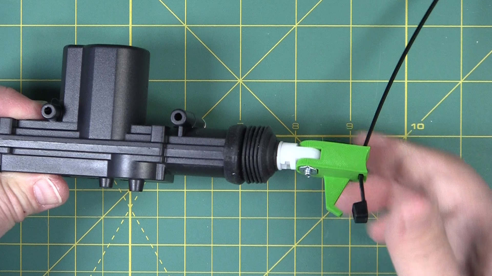

# Twitchy Cat Assembly
Adrian McCarthy (mechanics)  
based on Oak Lane Cemetery's [Undead Kitty][1]

This covers the assembly of the Twitchy Cat mechanism.  Suzanne Coberly has an excellent set of instructions for [posing and corpsing][12] the cat.

See https://www.github.com/aidtopia/twitchy_cat for the latest version of this document.

The first draft was distributed at the Northern California Haunters Group's March 2023 Make &amp; Take.  This substantially more complete draft is from April 2023.

## The Effect

A rotting corpse of a cat sporadically kicks its hind legs.  It's gruesome and may bother cat lovers.

## Parts

* [cat skeleton][2]
* [car door lock actuator][3] (with hardware)
* [1" hinge with screws][4]
* [spring][5]
* 8" cable ties
* [12V/8A DC power supply][6]
* [DC barrel connectors][7]
* inline fuse holder with 5A fuse (recommended)

But that's not all!

I recommend soldering wires and insulating them with heat-shrink tubing.  If soldering is not your thing, you can use [heat-shrink butt-splice connectors][8] that include a ring of low temperature solder in the middle.

You will also need a controller of some kind.  I'll cover how to put together a push button for manual control, using a [3D-printed case][9].  For the push button, you'll need:

* [3D-printed button case][9]
* [push button][11]
* 1N4001 or similar rectifier diode (recommended)

I'll also show how you can wire your cat to various prop controllers.

To make your skeleton look good and creepy, you'll need additional supplies covered in the [corpsing instructions][12].

### Linkage Options

The original version of these instructions explained how to fabricate a link from the brass rod that comes with the door lock actuator.  That can work.  However, the resulting linkage can be finicky.  In the worst case, it might buckle, locking up the mechanism in such a way that manual intervention is required.  I no longer recommend this method.

Instead, I recommend using this [3D-printed link][10] instead.  The printed link constrains the mechanism, ensuring that the actuator movement is translated into the kicking motion, without twisting and slipping that can happen with the old method.  The printed link also provide a better place to attach the spring.

The link can be printed with PLA filament, but I recommend PETG for more durability.  I got good results with 0.2 mm layer height.

To use the PRINTED LINK you will need:

* [3D-printed link][10]
* #6-32 x 1/2" machine screw
* #6-32 hex nut
* an extra cable tie

Norcal Haunters: You can get the PRINTED LINK parts from me, along with instructions on how to swap it in for the ROD LINK.

To use the ROD LINK you will need the brass rod the comes with the door lock actuators.

### Skeleton Selection

The salient features of the cat skeleton are that it be about 14", have an arched back, and that the rib cage ends by the middle of the spine.  I've seen a few that have unrealistically long rib cages that reach almost to the back legs.  Those won't work.

The Amazon link provided is a bit of a pot luck.  That supplier seems to have two similar-but-different models and ships whichever one is on hand:

* The GREEN skeletons are cast in a matte off-white plastic and dry-brushed with a greenish tint.  They have no wire in the tail.  The pelvis is upside down (the spine passes under the pelvic bone).  The greenish tint looks like it might be glow-in-the-dark paint, but&mdash;alas&mdash;it's not.

* The WHITE skeletons are cast in a glossy white plastic.  They have a wire in the rubbery tail to make it poseable, and the pelvis orientation is anatomically correct.

**Either will work for this project.**

## Tools

* phillips screwdrivers, #0, #1, and #2
* something pointy to make a small divot in the plastic
* a drill
* 1/16" drill bit
* a small hacksaw or similar
* wire cutters
* wire strippers
* heat gun
* soldering iron and solder (optional if you use the heat shrink splices)
* painters tape (optional)

For the ROD LINK you will also need:

* 1/8" drill bit
* felt tip marker (e.g., a Sharpie)
* a vise (to hold the rod while you bend it)
* a hammer
* small bolt cutters or a hack saw

## Steps

NOTE:  These steps assume the DISPLAY SIDE is the cat's left side.  If you corpse the cat all around, it doesn't much matter which side is the display side.  You might, however, want to do thorough corpsing on the display side and less on the other side so you can keep access to the mechanism.

### Posing the Tail

WHITE skeletons have wire inside the tail, so you can pose it later.  You may, however, want to remove the hind legs before moving on to **Adding the Hinge**.

GREEN skeletons do not have a wire in the tail, but there is a slight curl to it.  If it's curling down and you'll want it to curl up, (or vice versa), you can flip it around.  This requires disassembling the pelvis.

* Loosen the two screws that hold the hips together, using a philips #0 screwdriver (manual, not electric).
* Snip the cable tie (if there is one).
* Pull off the right side of the hip and its leg.
* Swivel the left side to revealing another small screw into the side of the spine just above  the tail.  Loosen that and remove the hip.
* Now you can remove the tail, flip it 180 degrees, and reinstall it.

**Pro tip:**  Consider postponing reassembly of the hips until after you've got the actuator installed.  Just don't lose the screws!

### Adding the Hinge

Oak Lane Cemetery hinged the spine by cutting it in two, drilling holes through each end, and reconnecting them with a cable tie (or two cable ties?).  That's easy to do, but I found that left too much play side-to-side, which caused the mechanism to bind.

My solution is to instead use an actual hinge.  Installing it requires a bit of dexterity, but I've learned that installing the hinge _before_ cutting the spine makes it manageable.

With the cat on its back, lay the open hinge on the spine, just beyond the last rib.

* On the GREEN skeletons, you'll probably find that the hinge will fit right behind the last rib, possibly just touching it.  If it doesn't fit there, it's fine to choose the next vertebra.

* On the WHITE skeletons, you'll almost certainly have to leave a one vertebra gap between the last rib and the hinge.

The pin of the hinge should be on the abdominal side, not against the spine itself.  The pin should be oriented so that it's perpendicular to the spine.  The flaps of the hinge with the screw holes should be on the wider parts of the vertabrae with the pin aligned with the narrow space in between.  

**Pro tip:**  Use some tape to temporarily hold the hinge in place.

Mark the spine through the centers of the screw holes with something sharp, like a punch or an awl.  That'll help keep the drill bit from skidding as you begin to drill.

Drill 1/16" pilot holes for the screws.  If the holes start right at the edge of the spine, you can angle them in toward the center a bit, so that the screws will have more plastic to dig into.

**CAUTION:**  Be aware of what's on the other side of the spine as you drill.  If you drill all the way through the spine (which is not necessary), you could drill into your hand or your table if you're not careful.

Use a hand screw driver to start one of the hinge screws into one of the holes.  Once you have the first one started, start the next one diagonally across.  Once you have all four started, double check the position of the hinge and then tighten them all down.

Careful! Especially on the WHITE skeletons, you may find that the tips of some of these screws go all the way through spine.  You can file the tips down.  Later you may want to cover it with some kind of filler (like sculpting epoxy).  Either way, the corpsing should hide it.

Remove the tape.

### Cutting the Spine

Turn the cat upright and cut through the spine in line with the hinge pin.

I recommend almost any small hand saw.  A few people had luck with a rotary tool (like a Dremel) on the WHITE skeletons, but I found the plastic was deeper than the cutting discs could reach on the GREEN ones.

Once you cut through, the hinge should allow you to bend the back of the spine toward the front of the cat.  If there's any binding, you might try shaving a little plastic away at the cut line.

### Preparing the Actuator

It's easier to perform these steps on the actuator before installing it into the rib cage.

#### Adding the Power Connector

Snip the connectors off the actuator's wires.

When power is applied, we want the actuator to extend, not retract.  With the actuators I use, the proper connections are:

* positive (RED) to BLUE wire on the actuator
* negative (BLACK) to the GREEN wire on the actuator

If your actuator's wires are a different color, you'll have to briefly activate the actuator with a power supply to figure out which polarity causes the actuator to extend.

Select a DC barrel receptacle.  Make sure you use the kind that your power supply would plug into, not the one that matches your power supply.  (People often use the words _male_ and _female_ to distinguish between mating connectors.  With these kinds of connectors, however, those terms can be counter-intuitive.)

Connect the wires to the receptacle using your favorite technique.

The actuator uses a remarkably high current, so it's important to have a good electrical connection.

* Proper soldering makes the best electrical connection, and you can then insulate that connection with heat shrink tubing.

* If soldering is not in your skill set, you can use the heat shrink butt-splice connectors that have the low temperature solder ring on the inside.

* I do not recomment wire nuts or crimp connectors for this connection.  If you want a temporary connection, lever nuts (e.g., Wago 221 Compact) are good, but you'll have to do that after installing the actuator since the lever nuts will not fit through the collar bone.

Note that DC barrel receptacles are not waterproof.  If you intend to operate your twitchy cat in a damp environment, substitute waterproof connectors or skip the connectors altogether and splice long wires all the way back to the controller.  In that case, make sure you use waterproof heat shrink to insulate the wire connections.

#### Pre-installing the Screw

Hold the actuator in your hand as though it's a sci-fi ray gun.  The long axis is the barrel of the gun, and the short one is the handle.  The moving end of the actuator should be pointing away from you.  Mark the forward mounting hole on your right side.  That's the one we're going to use to anchor the return spring.

Screw one of the larger screws that came with your actuator into the marked mounting hole.  The hole is not threaded, but the screws are self tapping.  Start slowly with a hand screw driver.  Leave the head of the screw protruding about 1/8".  Later, this will be the mounting point for one end of the spring.

#### Connecting the Printed Link

For the ROD LINK, skip this step.

For the PRINTED LINK, slip a cable tie through the channel near the end of the link.  Push most of the tie through, so that the "head" of the tie is close to the side of the link with the wing.  Do not zip the tie closed.  That'll come later.

As you hold the #6 hex nut in the hexagonal recess in the link, slip the link over the "nose" of the actuator and secure with the half-inch screw.  Do not over-tighten.  The link should swing freely at the end of the actuator.

### Installing the Actuator

The door lock actuator is installed in the rib cage.  I tried several different orientations, but the one used by Oak Lane Cemetery worked the best.

We're going to hold it in place with two cable ties.  In most cases, an 8" cable tie is sufficient, but some found they needed an 11" one.  The cable ties are going to encirle the long axis of the actuator to hold it against the sternum.  And they are going to be positioned one either side of the short cylinder part to keep the actuator from sliding forward and backward.

This step also requires a little dexterity.  As with the hinge step, you may find it much easier to leave the back legs off for now.  Also remember the cable ties are cheap and if you mess up, you can just snip them off and try again.

First insert a cable tie through last rib space below the shoulder until it exits the rib cage on the other side.  Push most of the slack in, the zip tie will flex upward until it touches the spine, leaving a clear path for the actuator.

Insert the actuator into the rib cage, wires first.  Guide the wires through the collar bone.  When it's in as deep as it can go, zip the cable tie so that it holds the actuator against the inside of the sternum.

Feed the second zip tie between the ribs and cinch it down.

The actuator should now be in line with the sternum.  If it twists or wiggles side-to-side, tighten up the cable ties.  If it slides forward and backward, check that you have a tie right in front of and another right behind the cylindrical part of the actuator (the handle of your ray gun).  If it's not firmly in place, snip the ties and try again.

Also ensure that the wires have come through the collar bone.

### Attaching the Printed Link to the Spine

For the ROD LINK, skip this step.

Note that the nose of the actuator swivels.  Turn it now so that the head of the #6 screw faces the display side of the cat and the wing of the printed link faces the opposite direction.

With the actuator fully retracted, pull the hind legs forward.  Rotate the printed link counterclockwise until you find the first spot on the spine where the free end is perpendicular to the spine.  This should be just above the hip bone.  Wrap the cable tie around the spine and secure it tightly around the narrow space between two vertebrae.

Manually move the actuator though its entire range of motion and make sure there is no binding.

### Reattaching the Rear Legs

If you removed the rear legs earlier, now is the time to reattach them.  Just reverse the steps given at the beginning.  If you lost a screw or you break something, don't fret.  Cable ties, hot glue, or sculpting epoxy can usually put Humpty Dumpty back together again.  Kludges can be hidden during corpsing.

### Making the Rod Linkage

If you're using the PRINTED LINK, skip this step.

If you're using the ROD LINK, get ready to bend some metal.

_TODO:  Add photos throughout this section._

The actuator hardware pack includes a brass rod with a bend and a cap at one end.  If yours is lost or damaged, you can make your own from coathanger wire.  (Better yet, get your hands on a PRINTED LINK instead!)

Starting from the left side of the cat, feed the straight end of rod through the nose of the actuator until you twist it at the bend.  The cap will keep that end in the actuator.

Pull the hind legs as far forward as you can.

Keeping the actuator retracted, move the rod until it lines up with the wide part of one of the vertabra on the right side of the cat.  You should choose a vertabra that keeps the rod almost inline with the actuator but slightly above it.

Use a felt marker to mark the rod where it touches the tip of the vertebra.

Clamp the rod in a vise at your mark.  Make a crisp 90° bend so that the back end is parallel to the end with the cap.

You want the end you just bent to extend about 1/2 to 3/4 inch.  Using small bolt cutters or a hack saw, trim off the excess.  You might want to file down any sharp points left by the cut.

Put your modified rod into the actuator and again line it up with the selected vertebra.  Looking at the bottom of the cat, estimate how much you will need to cut off of the wide part of the vertebra so that the rod can be parallel to the actuator.  Trim the tip off of the selected vertebra using a small saw, a utility knife, or a file.

Drill a 1/8" hole in the center of the trimmed tip.  Insert the cut end of the rod into that hole.

Looking from the bottom again, check that the rod is now parallel to the direction of the actuator.  Make adjustments as necessary.  You might need to shave more off the tip of the vertebra, drill the hole deeper, or trim the back end of the rod a bit more.

Holding the front end of the cat, you should be able to manually extend and retract the actuator and the hind legs should move accordingly.  If it's tight, look for ways to reduce the friction, such as further trimming or widening the hole.

### Wiring the Push Button

Even if you plan to use a programmable controller later, it's handy to have a push button controller for testing.

I'll assume you're using the 3D-printed button case and the recommended parts.

Norcal Haunters:  Your buttons are pre-wired.

We're going to wire the button with DC barrel connectors.  The power supply will connect to one and the other will connect to the actuator.

Push the wires from the DC barrel connectors through the narrow end of the 3D-printed case until they extend out the top by roughly the length of the case.  Use a small zip tie to create a strain relief.

Unscrew the jamb nut from the bottom of the button body.  If the button has a rubber O-ring, leave that cinched up against the flange.  Screw the button all the way into the small 3D-printed ring.

Note that the recommended button is rated for 10 amps.  The actuator draws 5-6 amps, which is more than many small push buttons are designed to handle.  This button has screw terminals, and the wires are stranded, so best practice is to crimp ferrules onto the wire ends before attaching them to the button.  Tinning them with a little solder will do in a pinch.

Now make the connections that happen inside the button case per the wiring diagram.  The black wires connect to each other.  Each red wire connects to a terminal on the bottom of the button.

I highly recommend adding a flyback diode as shown in the diagram.  When the actuator turns off, the diode will safely dissipate the energy stored in the actuator's coils.  Pay close attention to the diagram to make sure you get the diode in the correct direction.

Norcal Haunters:  Your pre-wired buttons have the diodes in place.

Gently pull the wires at the small end of the case while guiding the ring holding the button into the top of the case.  It should make a good friction fit.  If you want to make it more secure (and permanent), a couple drops of super glue (cyanoacrylate) should bond the two plastic parts.  The small zip tie should be sufficient strain relief, but a blob of hot glue at the small end will provide additional relief and help keep dust out.

### Testing the Kick Action

Connect the power supply to the appropriate connector on the button assembly.  Then connect the other connector to the one on the actuator.

CAUTION:  The actuator may be powerful enough to hurt a stray finger.  Keep your fingers away from any pinch points whenever the actuator might be triggered.

Briefly press the button, and the actuator should extend, causing the hind legs to kick.  Sometimes, this action is sharp enough that the mechanism will bounce, causing the actuator to retract most of the way.  Manually put the actuator back into its retracted position and try it again.  You should be getting a nice sharp kick without binding or buckling.

CAUTION:  Do not hold the button down.  When the actuator reaches its limit (which takes less than 1/10 second), it will draw its maximum current.  That causes the motor inside to heat up and it could burn itself out.  Short presses are best.

### Installing the Spring

The actuator could be powered in both directions, but that requires a motor driver (or multiple relays).  To keep things simple, we've wired the actuator to extend when it's activated, and we'll use a spring will pull it back when the power is switched off.

Hook one end of the spring to the screw you installed in the actuator.

For the PRINTED LINK, hook the other end of the spring onto the wing of the printed link.  The spring should be just slightly stretched when the actuator is fully retracted.  If you push the hind legs back and then release them, the spring should provide enough force to reliably retract the actuator.  You're ready to skip to the next step.

For the ROD LINK, you need to find the best spot on the spine to anchor the spring.  This takes trial and error.

Holding the free end of the spring at the tips of the vertebra, try to find one that provides enough force to reliably retract the actuator but not so much force that extending the actuator is difficult.  The first vertebra above where the link connects is a good first guess.

You can create a spring anchor point by using another one of the screws that came with your actuator.  Trim the NON-DISPLAY SIDE tip of a vertebra to make a flat surface.  Drill a 1/16" pilot hole into the plastic and manually drive in the screw.

Using your push button, test the kick action.

* If the kick seems sluggish or doesn't reach its full extent, the spring is too tight.  Try anchoring the spring on a higher vertebra or add a loop of cable tie to the end of the spring and hook that over the anchor.

* If the kick is sharp but the retraction isn't reliable, the spring is too loose.

* If the actuator is shifting around in the rib cage (or bending it), there's too much tension, or the spring is pulling up or down more than forwards.

Don't worry if you have to make more holes in the skeleton.  These anchors are on the NON-DISPLAY SIDE, and mistakes are easy to hide or fix in the corpsing process.

### Using a Controller

_TODO:  Wiring diagram for PicoBoo-like controllers_  
_TODO:  Information about Jeckyll-Labs Twitchboard_  
_TODO:  Warning against long activations_  

## Links

If you're reading the paper version of this, here are the links:

* Oak Lane Cemetery's Undead Kitty https://youtu.be/KJrArt0GAYc
* cat skeletons on Amazon https://www.amazon.com/dp/B00OXD4S5S
* car door lock actuators on Amazon https://www.amazon.com/dp/B00P2KANI2
* 1-inch hinges at The Home Depot https://www.homedepot.com/p/Everbilt-1-in-Zinc-Plated-Non-Removable-Pin-Narrow-Utility-Hinges-2-Pack-29277/314150752
* springs on Amazon https://www.amazon.com/dp/B07NRKNWT6
* 12V/8A DC power supply on Amazon https://www.amazon.com/dp/B00VA2K0MK
* DC barrel connectors on Amazon https://www.amazon.com/dp/B072BXB2Y8
* solder seal heat-shrink butt splice connectors on Amazon https://www.amazon.com/dp/B08F479K2R
* handheld button case on printables.com https://www.printables.com/model/430824-handheld-button
* link for Twitchy Cat on printables.com https://www.printables.com/model/455279-twitchy-cat-link
* push buttons on Amazon https://www.amazon.com/dp/B08QV4CWYW
* Posing and Corpsing Instructions: https://github.com/aidtopia/twitchy_cat/blob/main/documentation/twitchy_cat_corpsing.pdf

[1]: https://youtu.be/KJrArt0GAYc
[2]: https://www.amazon.com/dp/B00OXD4S5S
[3]: https://www.amazon.com/dp/B00P2KANI2
[4]: https://www.homedepot.com/p/Everbilt-1-in-Zinc-Plated-Non-Removable-Pin-Narrow-Utility-Hinges-2-Pack-29277/314150752
[5]: https://www.amazon.com/dp/B07NRKNWT6
[6]: https://www.amazon.com/dp/B00VA2K0MK
[7]: https://www.amazon.com/dp/B072BXB2Y8
[8]: https://www.amazon.com/dp/B08F479K2R
[9]: https://www.printables.com/model/430824-handheld-button
[10]: https://www.printables.com/model/455279-twitchy-cat-link
[11]: https://www.amazon.com/dp/B08QV4CWYW
[12]: https://github.com/aidtopia/twitchy_cat/blob/main/documentation/twitchy_cat_corpsing.pdf
